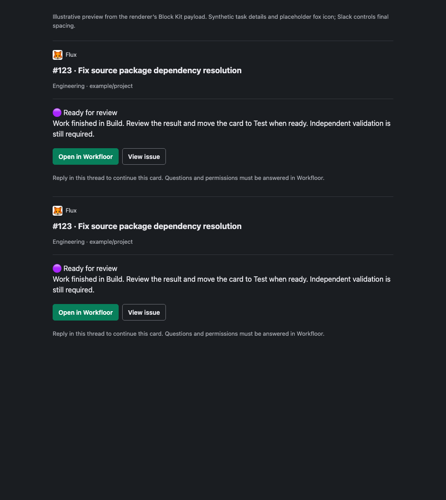
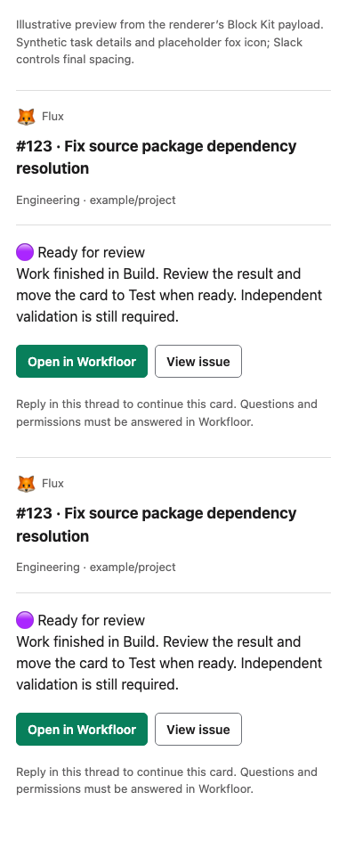

# Card identity verification — 2026-09-20

## Implementation and local checks

- RED: `go test ./server -run 'TestNotificationCardBranding' -count=1` failed because identity blocks and fallback names were missing before implementation.
- GREEN: `go test ./server -run 'TestNotificationCardBranding|TestBoundNotificationCard' -count=1` passed.
- Final regression: `go test -race ./server -run 'Test(Notification|BoundNotification|Notify|SessionFallback|Socket|SlashCommand|Mention)' -count=1` passed. Includes both notification paths, plain text, current and pre-branding receipt replay, changed-brand binding, all attention states, invalid branding, neighboring Socket Mode and slash/mention routing.
- `go vet ./server`, `make build`, and `git diff --check` passed.
- Both `make package-host verify-package-host MANIFEST=/tmp/slack-branding-manifest.yaml` and `make package verify-package MANIFEST=/tmp/slack-branding-manifest.yaml` passed. The manifest was generated by `python3 scripts/workfloor-manifest.py`.
- Cross-platform Workfloor package: `kandev-plugin-slack-0.6.1.tar.gz`, SHA256 `9c40ec7e81e1d855b0ae5e03d3dd9fb6ecb9b4169938b0a5742cfc078099b3bc`.

## Disposable host

Installed 0.6.0 then upgraded to the actual 0.6.1 package on an isolated local Workfloor host. Plugin remained active; previous settings and a plugin-data sentinel survived. New branding settings persisted successfully. No Slack credentials were used. The owned host process and temporary home were removed after the check.

## Visual preview

[Preview](preview.html) uses the renderer's [actual synthetic Block Kit payload](sample-blocks.json), with a placeholder fox icon. Both consecutive cards retain identity. Headless Chromium checked 1000px desktop dark and 390px mobile-width light layouts with no horizontal overflow. Screenshots were visually inspected.

These are illustrative local previews, not screenshots from Slack. They do not prove Slack mobile rendering or external image loading.

## Delivery still pending

Production has not been upgraded. After merge/install, set the app name to Flux and its public Slack icon URL, then inspect two new controlled notifications in actual Slack desktop/mobile. Do not resend existing records for their appearance. CI and PR results are recorded on the implementation PR, tied to its exact head.
